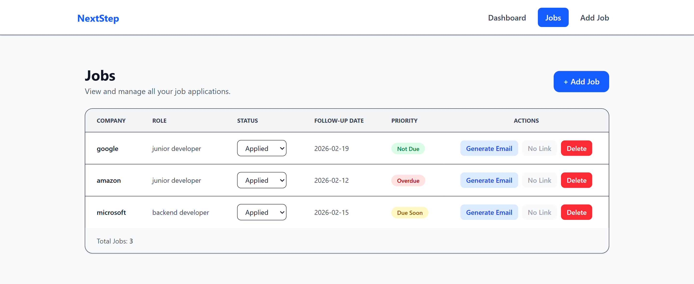
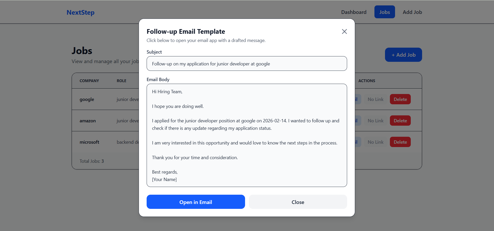

<p align="center">
  
</p>

# nextStep 🎯

## Basic Details

### Team Name: [Individual]

### Team Members
- Member 1: [Fathima Sadakkathulah] - [Indira Gandhi National Open University]

### Hosted Project Link
https://next-step-bice.vercel.app

### Project Description
**NextStep** is a smart job application tracker that helps users manage job applications, track job status, and prioritize follow-ups. It also generates a professional follow-up email draft and opens it directly in the email app using mailto integration.

### The Problem statement
Job seekers apply to multiple companies but often forget:
- where they applied
- application date
- follow-up deadlines
- current job status

This leads to missed opportunities and delayed follow-ups.


### The Solution
NextStep provides a simple dashboard where users can:
- store job application details in cloud database (Firebase Firestore)
- update job status (Applied / Interview / Offer / Rejected)
- get follow-up priority alerts (Overdue / Due Soon)
- generate a ready-to-send follow-up email and open it instantly in email client
- 
---

## Technical Details

### Technologies/Components Used

**For Software:**
- **Languages used:** JavaScript
- **Frameworks used:** React (Vite)
- **Libraries used:** Tailwind CSS, React Router DOM, Firebase
- **Tools used:** GitHub, Vercel, Firebase Console, VS Code

---

## Features

- Add job applications with details (company, role, link, notes)
- Track job status (Applied / Interview / Rejected / Offer)
- Smart follow-up priority system:
  - Overdue
  - Due Soon
  - Not Due
  - Closed
- Dashboard analytics (total applications, interviews, follow-ups due)
- Follow-up email template generator
- One-click **Open in Email** using mailto integration
- Data stored in **Firebase Firestore** for cloud access

---

## Implementation

### For Software:

#### Installation
```bash
git clone https://github.com/your-username/your-repo-name.git
cd your-repo-name
npm install

#### Run
```bash
npm run dev
```

## Project Documentation

### For Software:

#### Screenshots


Dashboard showing application stats, follow-ups due and recent applications.


Add jobs with proper details to track the next step.


Jobs list page with status update and follow-up priority.


Email modal that generates follow-up email draft and opens email app.


## AI Tools Used

**Tool Used:** [ChatGPT, Claude]

**Purpose:**
- Generating UI component structure
- Fixing deployment errors
- Improving README documentation

**Percentage of AI-generated code:** [60%]

**Human Contributions:**
- Feature planning and project architecture
- Firestore integration and debugging
- UI decisions and component integration
- Testing and deployment

---

## Team Contributions

- [Fathima Sadakkathullah]: [Complete frontend development, Firestore integration, follow-up logic, UI design, deployment, documentation]

---

Made with ❤️ at TinkerHub
